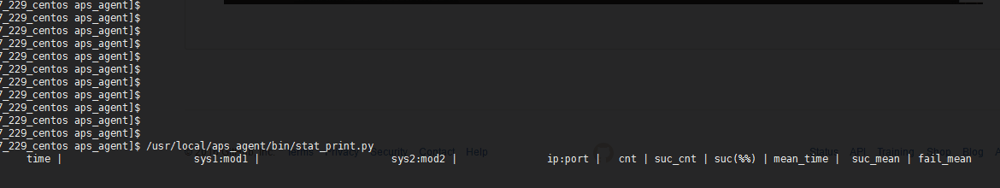
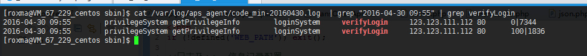

# Application Performance Statistics - 实时性能/可用性监控工具

## 功能

- 通过嵌入代码的方式统计代码块（调用远程服务，MySQL增删改查，Redis读写）的成功率，耗时，错误码分布，实现秒级别监控。
- （二期，server）统计数据收集，Web页面实现分钟级别的数据查询，展示，自动根据成功率变化发出预警。

## 性能考虑

- 轻量级，发送数据不阻塞业务代码，不影响业务本身可用性
- 高性能，实测单机可达20万/s以上的数据收集和处理速度。
- 资源占用少。
- 使用 UNIX domain socket Datagram 发送/收集数据，极端情况下允许数据丢失。

## 为什么做这件事情？

- 数据处理性能高，微秒级调用，不阻塞业务代码，可以用于在线上环境实时统计性能数据，方便找出系统的性能瓶颈（请求量，延时历史数据变化趋势），让系统调优工作有据可依。
- 未来可用于根据服务可用性（成功率）变化发出警报。

## 使用介绍

### 安装部署

- make，然后 make rpm 生成 rpm 文件
- 根据提示，找到生成的 rpm 文件路径，root 权限执行 rpm -ivh
    - 如果没有 root 权限安装 rpm，make 后可以先执行 `./bin/aps_agent $(whoami) unix_socket_dir log_dir` 用于测试。
- 启动 aps_agent，/usr/local/aps_agent
- 数据发送接口参考 report_api 的内容，文件底部的注释包含使用例子。

### 查看实时数据

### 查看错误码统计

